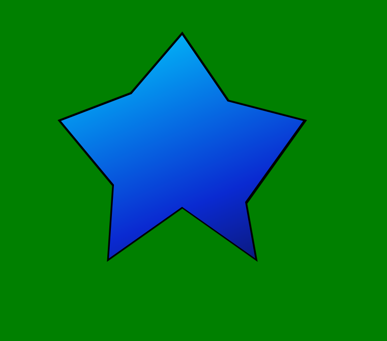

# CSS's clip-path Property

Let's say we have a photograph of, say, a friend standing atop a mountain. We'd like to cut away parts of it to make a rhombus and then frame it. In real life this is easy. All we need is a pair of scissors. And a frame.

We can achieve the same thing in CSS using `clip-path`. When we cut our rhombus in real life, we might start by cutting at the middle of the photograph's top edge towards the middle of the photograph's right edge and continue in this fashion until we've cut out the whole rhombus. CSS's `clip-path` is exactly that. We tell CSS to take a virtual pair of scissors and cut from one point of an element to the next until we are done. Cutting out a rhombus in CSS looks like this:

```
clip-path: polygon(50% 0%, 100% 50%, 50% 100%, 0% 50%);
```

Each pair of percentages describes a point at x%, y% from the top-left corner of the element. So 50% 0 describes the middle of an element's top edge.

Clip-paths can describe entirely arbitrary regions. For example, here's an ugly star with a border.



and the code used to render it:

```
body, #border {
	display: flex;
	justify-content: center;
	align-items: center;
}

body {
	width: 100vh;
	height: 100vh; /* I want a square body. */
	margin: auto;
	background-color: green;
}

#border, #star {
	clip-path: polygon(
		50% 0%,  /* starting at the middle of the top-edge */
		68% 27%, /* cut to this point */
		98% 35%, /* and so on */
		75% 68%, 
		79% 91%, 
		50% 70%, 
		21% 91%, 
		23% 61%, 
		2% 35%, 
		30% 24%
	);
}

#border {
	width: 50%;
	height: 50%;
	background: rgb(0, 0, 0);
}

#star {
	width: 97%;
	height: 97%;
	background: rgb(12,16,83);
	background: linear-gradient(
		337deg, 
		rgba(12,16,83,1) 0%, 
		rgba(10,42,209,1) 35%, 
		rgba(0,212,255,1) 100%
	);
}
```

```
<body>
<div id="border"><div id="star"></div></div>
</body>
```

Here's an extremely useful [clip-path maker](https://bennettfeely.com/clippy/).
