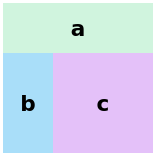

# The grid-template-area property in CSS

CSS' `grid-template-area` property can be used to create a grid with named cells of arbitrary rectangular areas.

```
#container {
	display: grid;
	grid-template-areas:
		"a a a"
		"b c c"
		"b c c";
	grid-template-rows: repeat(3, 50px);
	grid-template-columns: repeat(3, 50px);
	justify-items: center;
	align-items: center;
}

#a, #b, #c {
	width: 100%;
	height: 100%;
	display: flex;
	justify-content: center;
	align-items: center;
}

#a {
	grid-area: a;
	background-color: #d0f4de;
}

#b {
	grid-area: b;
	background-color: #a9def9;
}

#c {
	grid-area: c;
	background-color: #e4c1f9;
}
```

```
<div id="container">
	<div id="a">a</div>
	<div id="b">b</div>
	<div id="c">c</div>
</div>
```




